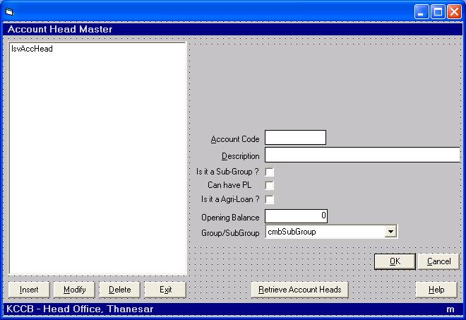



## Live Banking Software

### Description

The code basically gives an understanding of how actual banking software work in a real time transaction oriented environment. This is a multi-user transaction posting software. This source code handles all the day to day banking operations right from opening a account, savings, current, cc, rd, fd, dd/bc, loans, interest calculation, statements, atm, processing, rbi reports, communications with head office, reconcillations, centeral server repository etc. This source code basically gives you are good learning experience.
 
### More Info
 
First of all you have to setup the Oracle Database for this software. This is the essential part of this software. The oracle database is enclosed in it. I will provide personal attention to all serious guys who actually want to see the banking operation online. For any help you can mail me at

girlsfever_lovefever@yahoo.com. I will be more than happy to see your mails in order to live the project.

I am also going to upload all the system study of the banking segment which was done with Virmati Softwares Engineer. I basically worked with Virmati Softwares to actual understand the basics of the banking solution.

             |
---                |---
**Submitted On**   |2002-09-05 22:36:52
**By**             |[Tech Guru](https://github.com/Planet-Source-Code/PSCIndex/blob/master/ByAuthor/tech-guru.md)
**Level**          |Advanced
**User Rating**    |3.0 (18 globes from 6 users)
**Compatibility**  |VB 6\.0
**Category**       |[Complete Applications](https://github.com/Planet-Source-Code/PSCIndex/blob/master/ByCategory/complete-applications__1-27.md)
**World**          |[Visual Basic](https://github.com/Planet-Source-Code/PSCIndex/blob/master/ByWorld/visual-basic.md)
**Archive File**   |[Live\_Banki1889935202005\.zip](https://github.com/Planet-Source-Code/tech-guru-live-banking-software__1-60599/archive/master.zip)

### API Declarations

Hundred Thousands of API's have been used in this project, therefore i cannot list it out here. You better check out in the project itself.

